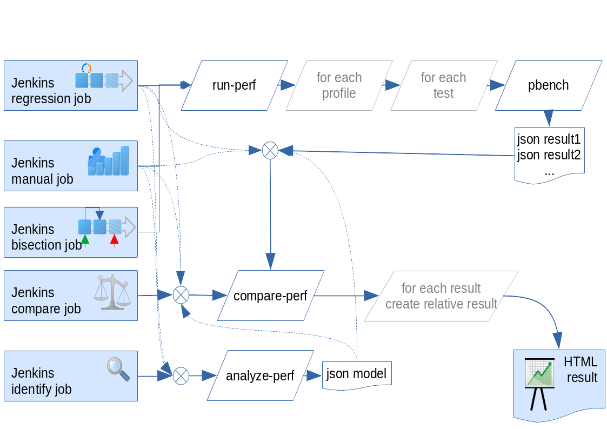

.. _jenkins:

===========================
Jenkins integration example
===========================

Runperf allows to integrate with Jenkins via xunit results and also can deliver
html results with great level of details especially for regression testing. Let
me present one example which is **not** meant to be copy&pasted to your
environment, but can serve as an inspiration for integration. An overview
might look like this:

Which might generate following html results (slightly outdated version
that compares a different setting on host and guest): `here <_static/html_result.html>`_

Let's create imagine we have ``example.org`` machine, we can create
``rp-example`` jpb to run regression testing, then ``rp-example-manual``
job to allow testing of changes or custom params. For each of these
we might want to create ``$name-ident`` jobs to allow cherry-picking
and analyzing of results in order to create models to easier evaluate
the expected results.

A useful addition is the ``rp-analysis`` job to allow running custom
compare queries without the need to download and run them from your
machines and the ``rp-prune-artifacts`` to automatically remove big
tarballs with full results and only keep the json results that are
small and suffice for compare-perf usecases.

The latest addition is an upstream qemu bisect pipeline called
``rp-example-upstream-bisect``.

All of these can be easily defined via `Jenkins Job Builder <https://docs.openstack.org/infra/jenkins-job-builder/>`_:

.. literalinclude:: jenkins/jobs.yml

Now let's have a look at the ``runperf.groovy`` pipeline:

.. literalinclude:: jenkins/runperf.groovy
   :language: groovy

Following ``compareperf.groovy`` pipeline is extremely useful for later
analysis, or extra comparison of manual pipelines:

.. literalinclude:: jenkins/compareperf.groovy
   :language: groovy

And the ``identify.groovy`` to allow creating linear models:

.. literalinclude:: jenkins/identify.groovy
   :language: groovy

The cleanup job ``prune_artifacts.py``:

.. literalinclude:: jenkins/prune_artifacts.py

And a bisect job ``upstream_bisect.groovy``:

.. literalinclude:: jenkins/upstream_bisect.groovy
